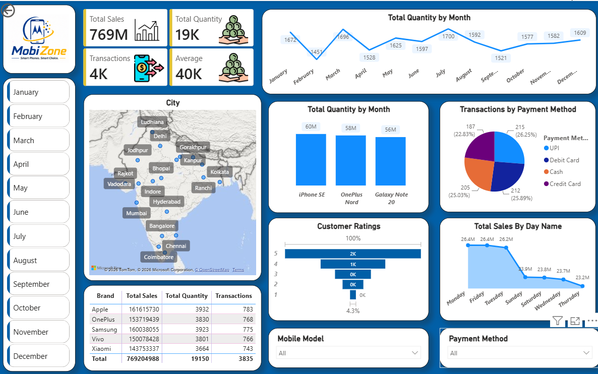

# 📱 MobiZone – Mobile Sales Analysis Dashboard

## 📌 Project Overview

**MobiZone – Mobile Sales Analysis** is an interactive **Power BI dashboard** developed to analyze mobile sales data and understand overall business performance.

The dashboard provides insights into **sales, quantity sold, transactions, brands, mobile models, customer ratings, payment methods, monthly trends, day-wise sales, and city-wise distribution**.

It is designed to help businesses monitor sales performance and identify useful patterns for better decision-making.

---

## 🎯 Project Objectives

* Analyze overall mobile sales performance
* Track total sales, quantity, and transactions
* Identify monthly sales and quantity trends
* Compare performance across mobile brands
* Analyze mobile model performance
* Understand customer rating distribution
* Analyze transactions by payment method
* Compare sales across different days of the week
* Visualize sales distribution across cities
* Build an interactive dashboard for business analysis

---

## 📊 Key Performance Indicators

The dashboard displays the following KPIs:

| KPI                    | Value |
| ---------------------- | ----: |
| **Total Sales**        |  769M |
| **Total Quantity**     |   19K |
| **Total Transactions** |    4K |
| **Average Sales**      |   40K |

---

## 📈 Dashboard Analysis

### 1. Monthly Quantity Analysis

The dashboard tracks the quantity of mobile phones sold across different months, helping identify changes and trends in monthly sales volume.

### 2. Brand Performance

The dashboard compares major mobile brands based on:

* Total Sales
* Total Quantity
* Transactions

The displayed analysis includes **Apple, OnePlus, Samsung, Vivo, and Xiaomi**.

### 3. Mobile Model Analysis

Mobile models can be compared based on the quantity sold, helping identify products with stronger sales performance.

### 4. Payment Method Analysis

Transactions are analyzed across different payment methods:

* UPI
* Debit Card
* Cash
* Credit Card

This helps understand customer payment preferences.

### 5. Customer Rating Analysis

The dashboard visualizes customer ratings from **1 to 5**, providing an overview of customer feedback and satisfaction levels.

### 6. Day-wise Sales Analysis

Sales are compared across different days of the week to identify high- and low-performing sales days.

### 7. City-wise Analysis

A geographical visualization is used to show the distribution of mobile sales across different cities in India.

---

## 🎛️ Interactive Filters

The dashboard includes interactive filters that allow users to explore the data dynamically:

* **Month**
* **Mobile Model**
* **Payment Method**

These filters make it easier to analyze specific time periods, products, and payment categories.

---

## 💡 Key Insights

Some key observations from the dashboard include:

* **Apple** has the highest total sales among the displayed brands.
* **Samsung** has the highest total quantity among the displayed brands.
* **UPI** accounts for the highest share of transactions among the displayed payment methods.
* **July** records the highest monthly quantity in the displayed monthly trend.
* **Monday and Friday** show the highest sales among the displayed days.
* The dashboard shows a large concentration of customer ratings at **5 stars**.

---

## 🛠️ Tools & Technologies

* **Power BI**
* **Power Query**
* **DAX**
* **Data Cleaning & Transformation**
* **Data Analysis**
* **Data Visualization**

---

## 📷 Dashboard Preview



---

## 📂 Project Structure

```text
MobiZone-Mobile-Sales-Analysis/
│
├── MobiZone.pbix
├── README.md
│
└── screenshot/
    └── mobiZone-dashboard.png
```

---

## 🚀 Project Highlights

This project demonstrates practical skills in:

* Data cleaning and transformation
* Power BI dashboard development
* Data visualization
* KPI creation
* DAX-based analysis
* Interactive filtering
* Business-oriented data analysis
* Extracting actionable insights from sales data

---

## 👩‍💻 Author

**Ayushi Joshi**

**GitHub:** https://github.com/ayushijoshi3010
